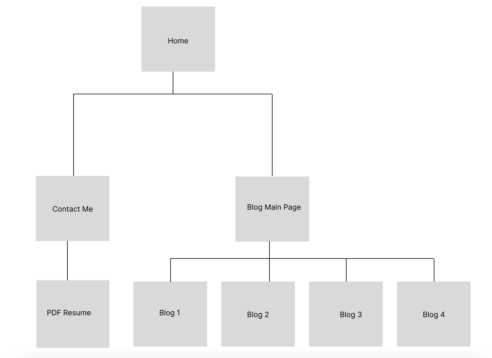
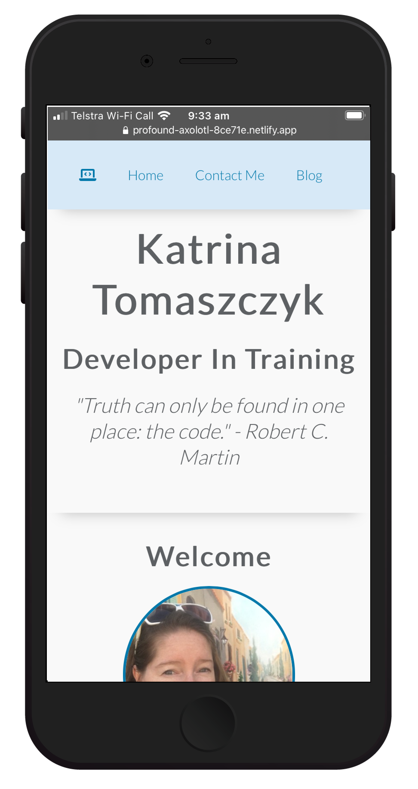
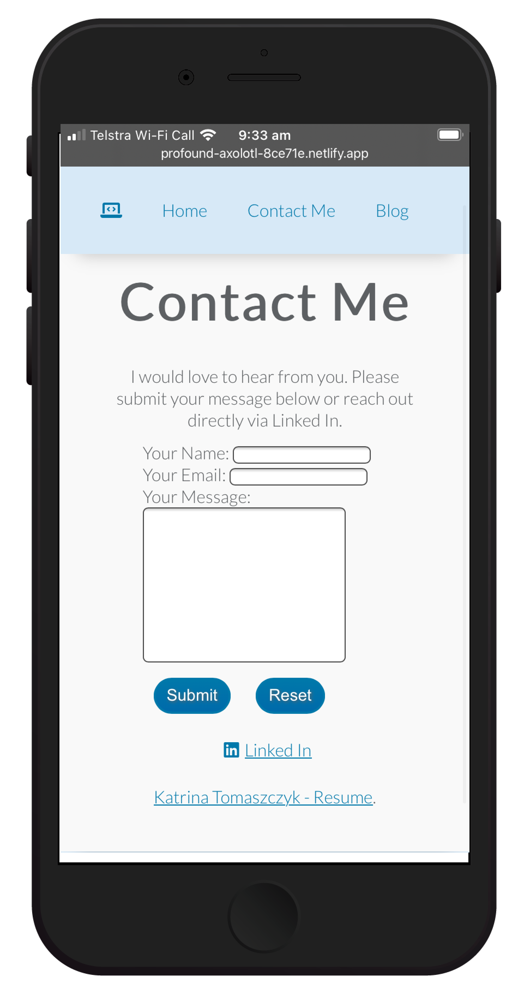
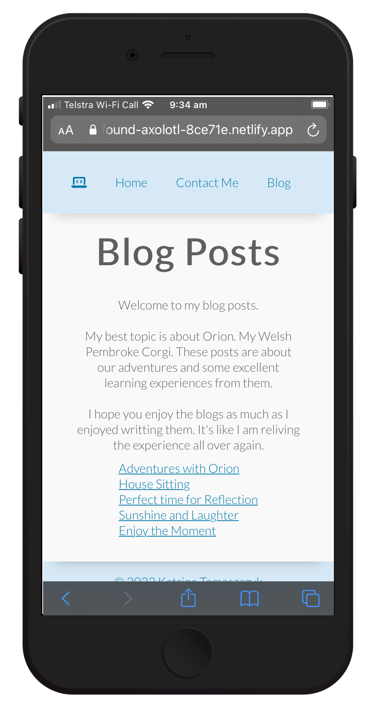

# T1A2 - PORTFOLIO

[katrinatomaszczyk_t1a2](https://github.com/KatrinaTom/katrinatomaszczyk_t1a2)

[Netlify - Deployed Portfolio](https://profound-axolotl-8ce71e.netlify.app/index.html)

[Vimeo - Online Presentation](https://vimeo.com/742081295/b15d0b5c3a)

---

## Purpose

* Create a portolio website - presents yourself as a developer and IT Professional.
* Online portfolio that provided information about you, your skills, interests, professional knowledge and a showcase of your work.

---

### High Level Requirements
Design/ Develop/ Deploy a website
* HTML/ CSS Portfolio 
* Powerpoint Presentation
* Video dicussing the Portfolio

### Target Audience

Target Audience is for a potential employer who has the following expectations:
- Technical knowledge
- Software development
- Programing Languages 
- Development Stacks
- High expectations of professionalism and positive work ethic

---

## Requirements
1. 4 HTML documents - link together and share a common theme
2. resent the following information: 
   * [Your name and Contact Details] 
   * [Links to professional Accounts] 
   * [ Your work history - resume ] 
   * [Demonstrate Personalisility, skills/interests] 
   * [ list of blog posts, titles and dates published]
3. Blog of FIVE (5) sample posts + FIVE images. One image for each post

---

## Features
* Clearly highlight the IT professional
* Online portfolio available
* Information on the individual 
* Showcases work through Git Hub
* Present previous experience through LinkedIn and Resume 
* Website Designed/ Developed/ Deployed

## Tech Stack
* HTML
* CSS
* Flexbox CSS
* Git
* Git Hub
* Netlify

---

## Sitemap

### Thought Process

Navigation: What to include and how best to present the documentation. 

Clicking links redirecrts to the Relevent Content.

Only really need to redirect is Contact (Main Purpose)

*(As a further employer, 
I want to easily contact a developer
So that I can offer them a job)*

Everything else can be scrollable on MW/ DT can be easily seen on a screen with hints that there is more.

Result: Simple Navigation/ Reusable compoments/ easy to add more blogs in the future

Home | Contact Me | Blog 

Blog is the one that redirects to a different page, this is so this location can be expanded and more blogs added in the future.

---
## Screenshots

### Home Page

### Contact Page

### Blog Page

---

## Powerpoint Presentation 

[Portfolio Presentation](portfolio.pdf)

---

## Reflection

**Worked Well**
* HTML/ CSS - Learning resources available
* Flexbox CSS Layout
* Responsive Design 
* Wireframe/ Opportunity Assessment and Low-Fi Designs
* Practicing Animations 
* Testing on Mobile Devices/ Different Browsers

**Opportunities to Improve**
* New experience with Figma - Steep learning Curve
* Took longer than expected to decide on a design
* Design Revisions while coding (Slow down to go faster in the beginning)
* Certain animations do not work on MW with HTML/CSS
* More practice on Git - Version Control
